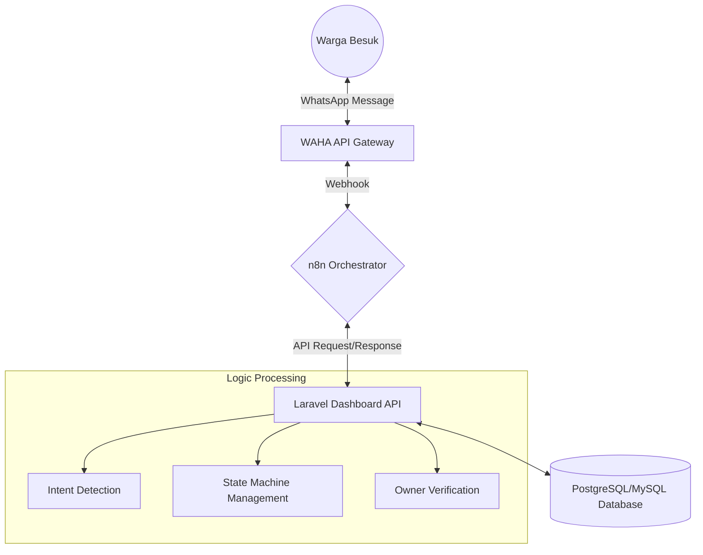

# 🏛️ Sistem Integrasi Layanan Publik Digital (SILAP) - Kecamatan Besuk

[](https://laravel.com)
[](https://n8n.io)
[](https://www.docker.com)
[](https://waha.devlikeapro.pro/)

> **"Mewujudkan Pelayanan Prima melalui Transformasi Digital yang Inklusif dan Akuntabel."**

Selamat datang di repositori resmi **SILAP (Sistem Integrasi Layanan Publik)** Kecamatan Besuk. Proyek ini merupakan inisiatif strategis untuk memodernisasi kanal komunikasi antara pemerintah kecamatan dan masyarakat melalui integrasi *WhatsApp Automation*, *n8n Orchestration*, dan *Centralized Dashboard Management*.

---

## 📝 Deskripsi Proyek

SILAP dirancang untuk menghilangkan hambatan administratif dan mempercepat respon layanan publik. Dengan memanfaatkan platform WhatsApp sebagai antarmuka utama, masyarakat dapat mengakses berbagai layanan tanpa perlu mengunduh aplikasi tambahan, sejalan dengan prinsip *Service at Your Fingertips*.

### Pilar Utama Sistem:
1. **Pemberdayaan Ekonomi (UMKM & Jasa)**: Digitalisasi data pelaku usaha lokal untuk meningkatkan visibilitas dan akses pasar.
2. **Transparansi Administrasi**: Fitur pelacakan status berkas secara *real-time*.
3. **Respon Cepat (Quick Response)**: Penanganan pengaduan masyarakat yang terintegrasi langsung ke sistem internal.
4. **Efisiensi Birokrasi**: Otomatisasi alur kerja rutin menggunakan *low-code orchestration*.

---

## 🏗️ Arsitektur Sistem (Technical Architecture)

Sistem ini menggunakan pendekatan **"Single Source of Truth"** di mana Dashboard Laravel bertindak sebagai "Otak" utama untuk seluruh logika bisnis dan penyimpanan data.



### Komponen Teknis:
- **Core Engine**: Laravel 10+ (PHP 8.2) sebagai pengelola basis data dan API internal.
- **Workflow Orchestrator**: n8n untuk normalisasi pesan, *anti-looping*, dan penjadwalan.
- **WhatsApp Gateway**: WAHA (WhatsApp HTTP API) untuk konektivitas pesan yang stabil.
- **Infrastructure**: Containerized environment menggunakan Docker & Docker Compose.

---

## ✨ Fitur Unggulan

| Fitur | Deskripsi | Status |
| :--- | :--- | :--- |
| **Cek Status Berkas** | Monitoring progress permohonan surat/administrasi secara otomatis. | ✅ Produksi |
| **Direktori UMKM** | Pencarian produk lokal berdasarkan kata kunci cerdas. | ✅ Produksi |
| **Layanan Jasa Lokal** | Menghubungkan warga dengan penyedia jasa (tukang, teknisi, dll). | ✅ Produksi |
| **Portal Loker** | Informasi lowongan kerja terkini di wilayah Kecamatan Besuk. | ✅ Produksi |
| **Pengaduan Masyarakat** | Integrasi alur pengaduan formal dengan manajemen status. | ✅ Produksi |
| **Kontrol Owner** | Fitur khusus bagi pelaku usaha untuk mengelola status "Lapak" via WA. | ✅ Produksi |

---

## 🚀 Panduan Instalasi (Quick Start)

### Prasyarat (Prerequisites):
- Docker & Docker Compose (Versi terbaru)
- Alat autentikasi WhatsApp (Handphone aktif)

### Langkah-langkah Deployment:

1. **Clone Repositori**:
   ```bash
   git clone https://github.com/benchoaz/KECAMATAN-LAYANAN-WHATSAPP.git
   cd KECAMATAN-LAYANAN-WHATSAPP
   ```

2. **Konfigurasi Environment**:
   Salin file `.env.example` di setiap folder (`dashboard-kecamatan`, `whatsapp`) dan sesuaikan `WAHA_API_KEY` serta `DASHBOARD_API_TOKEN`.

3. **Jalankan Container**:
   ```bash
   docker-compose up -d
   ```

4. **Pairing WhatsApp**:
   Akses dashboard WAHA di port `3000` untuk memindai kode QR dan menghubungkan nomor WhatsApp layanan.

---

## 🛡️ Keamanan & Etika Layanan

Kami berkomitmen untuk menjaga kerahasiaan data masyarakat sesuai dengan kaidah **Sistem Pemerintahan Berbasis Elektronik (SPBE)** di Indonesia. Seluruh log interaksi dienkripsi dan hanya digunakan untuk kepentingan peningkatan kualitas layanan publik.

---

## 🤝 Kontribusi

Apresiasi tinggi bagi rekan-rekan pengembang yang ingin berkontribusi. Silakan ajukan *Pull Request* atau sampaikan isu terkait melalui kanal yang tersedia. Mari bersama-sama membangun teknologi yang bermanfaat bagi nusa dan bangsa.

**Hormat kami,**

**Tim Pengembang SILAP - Kecamatan Besuk**
*Untuk Masyarakat, Oleh Teknologi.*
