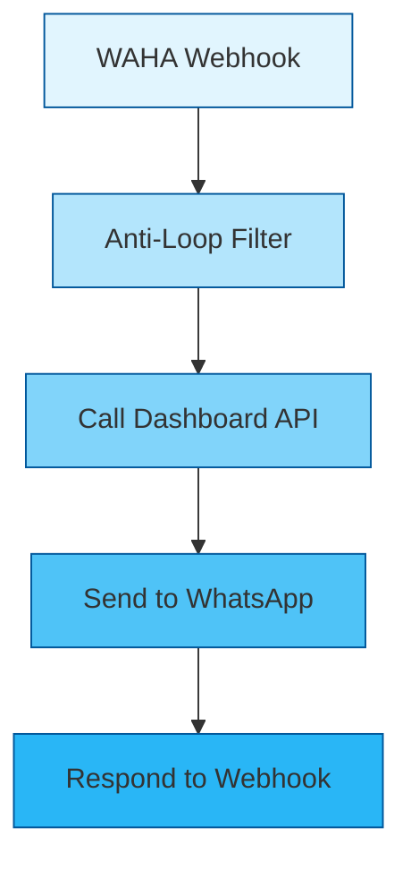
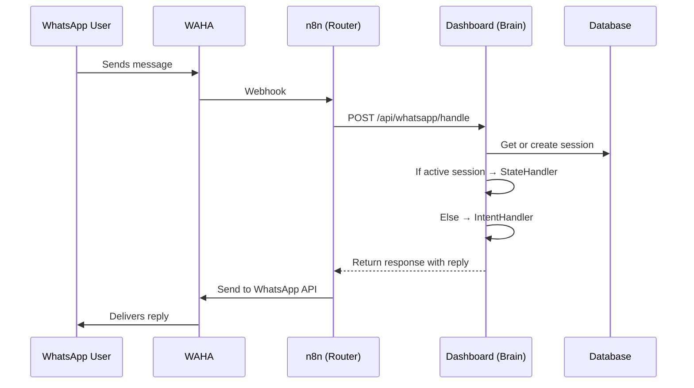
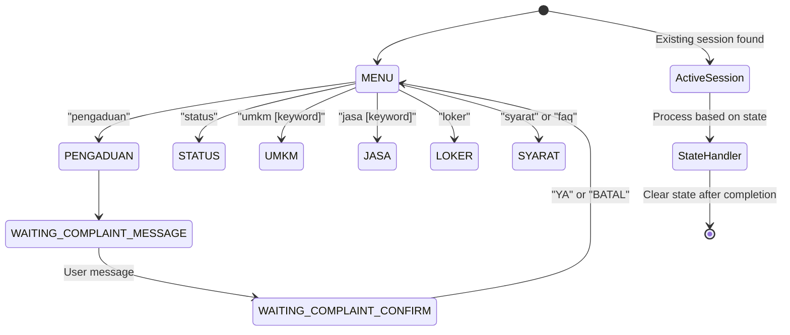

# WhatsApp Bot Integration - Root Cause Analysis & Refactor Plan

## 1. Root Cause Analysis Table

| Issue | Root Cause | Location | Severity | Fix Priority |
|-------|------------|----------|----------|--------------|
| **State Loss (Pengaduan Flow)** | When user sends "Pengaduan" → bot asks for message → user sends message, n8n's intent detector (with strict regex `/^(pengaduan|...|4)$/`) doesn't recognize free text as valid, so it routes to "unknown" intent instead of checking active session state in Dashboard. n8n's stateless design and duplicate intent logic conflicts with Dashboard's state management. | [`whatsapp/n8n-workflows/whatsapp-classifier.json`](whatsapp/n8n-workflows/whatsapp-classifier.json) | HIGH | 1 |
| **Routing Inconsistency (Cek Status Berkas)** | Similar issue - n8n's strict regex patterns and duplicate intent detection logic that doesn't respect the Dashboard's state management. If user input contains "cek" or "status" in any context, it routes to status check bypassing active sessions. | [`whatsapp/n8n-workflows/whatsapp-classifier.json`](whatsapp/n8n-workflows/whatsapp-classifier.json) | HIGH | 1 |
| **Fallback Loops** | Complex n8n workflow (22 nodes, 7 branches) with redundant logic causes looping when messages don't match strict regex patterns. Stateless design means it can't track conversation context, leading to repeated fallback to menu/status. | [`whatsapp/n8n-workflows/whatsapp-classifier.json`](whatsapp/n8n-workflows/whatsapp-classifier.json) | MEDIUM | 1 |
| **SYARAT Not in Main Menu** | Dashboard's IntentHandler has SYARAT/FAQ functionality but it's not listed in the MENU response. Users must implicitly know to use "syarat" or "faq" keywords instead of seeing it as an explicit menu option. | [`dashboard-kecamatan/app/Services/WhatsApp/IntentHandler.php`](dashboard-kecamatan/app/Services/WhatsApp/IntentHandler.php:105-126) | MEDIUM | 2 |

## 2. Architecture Refactor Plan

### Simplified n8n Workflow (4-6 Nodes)

**Architecture Principle**: n8n as **Router Only** - Dashboard as **Single Source of Truth**



Key Changes:
- **Remove all business logic from n8n** - no intent detection, no regex patterns
- **Single API call to Dashboard** - Dashboard handles state, intent, and response
- **Use existing simplified workflow** - [`whatsapp/n8n-workflows/whatsapp-router-v2-simplified.json`](whatsapp/n8n-workflows/whatsapp-router-v2-simplified.json)

### Dashboard as Single Source of Truth



### State Management Flow



## 3. Menu Redesign

### Current Menu (Incomplete)
```
🏛️ MENU LAYANAN KECAMATAN BESUK
📋 STATUS - Cek status berkas layanan
🏪 UMKM [kata kunci] - Cari produk UMKM
🔧 JASA [kata kunci] - Cari penyedia jasa
💼 LOKER - Lihat lowongan kerja
📢 PENGADUAN - Sampaikan keluhan/aduan
⚙️ TOGGLE - Kelola status lapak/jasa Anda
```

### New Menu (Complete)
```
🏛️ MENU LAYANAN KECAMATAN BESUK

Silakan pilih layanan yang Anda butuhkan:

📋 *STATUS* - Cek status berkas layanan
🏪 *UMKM [kata kunci]* - Cari produk UMKM
   Contoh: _umkm bakso_
🔧 *JASA [kata kunci]* - Cari penyedia jasa
   Contoh: _jasa tukang_
💼 *LOKER* - Lihat lowongan kerja
📢 *PENGADUAN* - Sampaikan keluhan/aduan
ℹ️ *SYARAT* - Informasi syarat & FAQ layanan
⚙️ *TOGGLE* - Kelola status lapak/jasa Anda

Ketik *MENU* kapan saja untuk kembali ke menu ini.
```

### Updated Intent Detection Patterns

**File**: [`dashboard-kecamatan/app/Services/WhatsApp/IntentHandler.php`](dashboard-kecamatan/app/Services/WhatsApp/IntentHandler.php)

Add SYARAT intent:
```php
// SYARAT/FAQ intent
if ($this->matchesIntent($messageLower, ['syarat', 'faq', 'informasi', 'pertanyaan'])) {
    return $this->faqHandler->handle();
}
```

## 4. Implementation Checklist

### Phase 1 - Critical Fixes (Priority 1)
- [ ] **Replace n8n workflow** - Import simplified router workflow (`whatsapp-router-v2-simplified.json`)
- [ ] **Verify API token** - Ensure token in n8n workflow matches Dashboard's `DASHBOARD_API_TOKEN`
- [ ] **Update API endpoint** - Confirm Dashboard URL in n8n is correct (`http://dashboard-kecamatan-nginx/api/whatsapp/handle`)
- [ ] **Configure WAHA webhook** - Point WAHA webhook to n8n's `/webhook/whatsapp-webhook` endpoint
- [ ] **Testing** - Test the full flow: "Pengaduan" → message → confirmation

### Phase 2 - Menu Enhancement (Priority 2)
- [ ] **Create FAQ Handler** - Implement `FaqHandler.php` to search `pelayanan_faqs` table
- [ ] **Update IntentHandler** - Add SYARAT intent detection and menu option
- [ ] **Update Menu Response** - Modify `menuIntent()` method in IntentHandler
- [ ] **Testing** - Verify "SYARAT" menu option works correctly

### Phase 3 - Gateway Improvements (Priority 3)
- [ ] **Add rate limiting** - Implement throttling middleware in WhatsApp API Gateway
- [ ] **Add security headers** - Configure CORS, CSRF, and security headers
- [ ] **Fix container name** - Ensure docker-compose container names match documentation

### Phase 4 - Monitoring & Documentation (Priority 4)
- [ ] **Update documentation** - Revise integration guide with new workflow architecture
- [ ] **Add logging** - Enhance WhatsApp interaction logging
- [ ] **Monitoring setup** - Configure health check endpoints

## 5. Key Files to Modify

1. [`dashboard-kecamatan/app/Services/WhatsApp/FaqHandler.php`](dashboard-kecamatan/app/Services/WhatsApp/) - NEW: FAQ handler service
2. [`dashboard-kecamatan/app/Services/WhatsApp/IntentHandler.php`](dashboard-kecamatan/app/Services/WhatsApp/IntentHandler.php) - Update menu and add SYARAT intent
3. [`dashboard-kecamatan/routes/api.php`](dashboard-kecamatan/routes/api.php) - Ensure FAQ search endpoint is properly configured
4. [`whatsapp/n8n-workflows/`](whatsapp/n8n-workflows/) - Use `whatsapp-router-v2-simplified.json` instead of complex workflows
5. [`whatsapp/docker-compose.yml`](whatsapp/docker-compose.yml) - Verify container network configuration

## 6. Expected Results

After refactor:
- ✅ **State loss fixed** - User can complete "Pengaduan" flow without getting "Maaf saya tidak mengerti"
- ✅ **Routing consistency** - Active sessions are respected, messages routed correctly
- ✅ **Fallback loops eliminated** - Simplified workflow with single decision point (Dashboard)
- ✅ **SYARAT menu option** - Explicit "SYARAT" option in main menu
- ✅ **Easier maintenance** - All logic centralized in Dashboard, n8n is simple router
