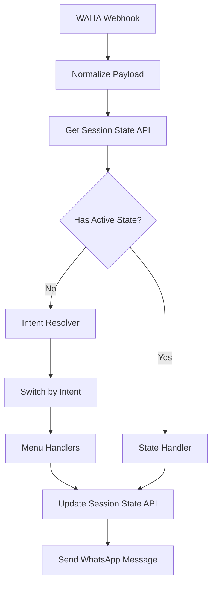

# N8N WhatsApp Bot Troubleshooting Report

## Project Overview
**Project**: WhatsApp Bot for Kecamatan Besuk  
**File**: `n8n-workflows/whatsapp-bot-besuk.json`  
**Purpose**: Automated WhatsApp bot with 4 main menu options (Layanan Administrasi, UMKM & Jasa, Lowongan Kerja, Pengaduan)  
**Last Updated**: 2026-02-15 23:35 WIB

---

## ✅ Implementation Status

### Phase 1: Critical Security (COMPLETED)
- ✅ Database migrations created (4 files)
- ✅ Models updated with security fields
- ✅ API security implemented (phone masking, filtering, limits)
- ✅ API Token Management System deployed
- ✅ N8N workflows created with 4-menu structure

### Phase 2: N8N Architecture Improvements (IN PROGRESS)
- ⏳ Intent Resolver pattern implementation
- ⏳ State machine for multi-step conversations
- ⏳ Database-based conversation state tracking

---

## Issues Encountered and Solutions Applied

### Issue 1: "Unknown error" in Code Nodes
**Symptom**: Workflow execution failed with "Unknown error" in Code nodes.

**Root Cause**: N8N Code nodes with `typeVersion: 2` require parameter `jsCode` instead of deprecated `functionCode`.

**Solution Applied**: Replaced all 11 occurrences of `"functionCode":` with `"jsCode":` in the workflow file.

**Status**: ✅ Fixed

---

### Issue 2: Bot Not Responding to Messages
**Symptom**: Workflow executed successfully but bot did not send any WhatsApp message back.

**Root Cause**: The workflow used "Respond to Webhook" node which only returns JSON to WAHA, but does not actively send a WhatsApp message.

**Solution Applied**: Replaced "Respond to Webhook" node with HTTP Request node that calls WAHA API:
```
POST http://waha:3000/api/sendText
Headers: X-Api-Key: 62a72516dd1b418499d9dd22075ccfa0
Body: { "chatId": "phone@c.us", "text": "message", "session": "default" }
```

**Status**: ✅ Fixed

---

### Issue 3: "Bad request" Error in Send WhatsApp Message Node
**Symptom**: HTTP Request to WAHA API returned "Bad request - please check your parameters".

**Root Cause**: Missing `session` parameter in request body. WAHA requires session identifier.

**Solution Applied**: Added `"session": "default"` to the JSON body.

**Status**: ✅ Fixed

---

### Issue 4: Normalize Payload Node Returns Empty Array
**Symptom**: Workflow stopped at "Normalize Payload" node, no data passed to next nodes.

**Root Cause**: WAHA webhook sends data in nested structure:
```json
{
  "event": "message",
  "payload": {
    "from": "6282231203765@c.us",
    "body": "Menu"
  }
}
```
The code was trying to access `input.body` and `input.from` directly instead of `input.payload.body` and `input.payload.from`.

**Solution Applied**: Updated code to extract from nested payload:
```javascript
const payload = input.payload || input;
const message = payload.body || payload.message || '';
const from = payload.from || payload.sender || '';
```

**Status**: ✅ Fixed

---

### Issue 5: All Menu Options Return to Main Menu
**Symptom**: When user sends "1", "2", "3", or "4", bot always responds with main menu instead of the selected option.

**Root Cause**: 
1. **Intent Detection Conflict**: The regex pattern for MENU included `1`, which matched before STATUS could be detected.
2. **Intent Router Mismatch**: The order of rules in Intent Router did not match the order of output connections.

**Example of the problem**:
- Intent Detection: `1` matches MENU pattern first (because MENU was checked before STATUS)
- Intent Router: Output 0 was connected to Menu Response
- Result: All inputs routed to Menu Response

**Solution Applied**:
1. Removed `1` from MENU pattern in Intent Detection
2. Reordered Intent Detection to check STATUS, UMKM_JASA, LOKER, COMPLAINT before MENU
3. Reordered Intent Router rules to match: STATUS → UMKM_JASA → LOKER → COMPLAINT → TOGGLE → MENU
4. Updated Intent Router connections to match new rule order

**Status**: ⚠️ Needs Verification - User should re-import workflow and test

---

## Current Workflow Structure

```
WhatsApp Webhook (WAHA Trigger)
       ↓
Normalize Payload (extract from, body from payload)
       ↓
Intent Detection (regex matching)
       ↓
Intent Router (Switch node with 7 outputs)
       ↓
┌──────────┬──────────┬──────────┬──────────┬──────────┬──────────┬──────────┐
│ Output 0 │ Output 1 │ Output 2 │ Output 3 │ Output 4 │ Output 5 │ Output 6 │
│ STATUS   │ UMKM_JASA│ LOKER    │ COMPLAINT│ TOGGLE   │ MENU     │ UNKNOWN  │
└────┬─────┴────┬─────┴────┬─────┴────┬─────┴────┬─────┴────┬─────┴────┬─────┘
     │          │          │          │          │          │          │
     ↓          ↓          ↓          ↓          ↓          ↓          ↓
  Status     UMKM       Loker    Complaint   Toggle      Menu     Unknown
  Prompt     Search     Search    Prompt     Handler   Response  Response
     │          │          │          │          │          │          │
     └──────────┴──────────┴──────────┴──────────┴──────────┴──────────┘
                                    ↓
                        Send WhatsApp Message
                        (HTTP POST to WAHA API)
```

---

## Technical Details for N8N Expert

### WAHA Webhook Payload Structure
```json
{
  "id": "evt_xxx",
  "timestamp": 1771171749,
  "event": "message",
  "session": "default",
  "metadata": {
    "me": {
      "id": "6281331699112@c.us",
      "pushName": "Bot Name"
    }
  },
  "payload": {
    "id": "false_6282231203765@c.us_xxx",
    "timestamp": 1771171749,
    "from": "6282231203765@c.us",
    "fromMe": false,
    "source": "app",
    "to": "6281331699112@c.us",
    "body": "Menu",
    "type": "chat"
  }
}
```

### WAHA API Send Message
```
POST http://waha:3000/api/sendText
Headers:
  X-Api-Key: 62a72516dd1b418499d9dd22075ccfa0
Body:
{
  "chatId": "6282231203765@c.us",
  "text": "Message content",
  "session": "default"
}
```

### Intent Detection Patterns
```javascript
const intents = [
  { name: 'PIN_REQUEST', patterns: [/pin baru|lupa pin|reset pin|minta pin/i] },
  { name: 'TOGGLE', patterns: [/^(tutup lapak|buka lapak|tutuplapak|bukalapak)$/i] },
  { name: 'STATUS', patterns: [/^(status|cek berkas|cek status|tracking|1)$/i] },
  { name: 'UMKM_JASA', patterns: [/^(umkm|jasa|produk|tukang|usaha|2)$/i] },
  { name: 'LOKER', patterns: [/^(loker|lowongan|kerja|pekerjaan|3)$/i] },
  { name: 'COMPLAINT', patterns: [/^(pengaduan|lapor|keluhan|komplain|4)$/i] },
  { name: 'MENU', patterns: [/^(menu|bantuan|help|mulai|start|halo|hai|p)$/i] }
];
```

---

## Files Modified
1. `n8n-workflows/whatsapp-bot-besuk.json` - Main workflow file

## Pending Verification
- User needs to re-import the updated workflow
- Test all menu options (1, 2, 3, 4)
- Verify correct routing to respective handlers

---

## Questions for N8N Expert
1. Is there a better way to handle the Switch node routing to avoid order dependency?
2. Should we use a different approach for intent detection (e.g., AI/NLP node)?
3. Is the current payload extraction method robust enough for edge cases?
4. How to handle state/conversation flow (e.g., user sends "1" then a phone number for status check)?

---

## 🎯 Expert Recommendations (Received 2026-02-15)

### Summary of Professional Feedback

| Issue | Current Approach | Expert Recommendation | Priority |
|-------|------------------|----------------------|----------|
| **Switch Routing** | Regex in Switch rules (order-dependent) | Intent Resolver Code Node → exact match Switch | 🔴 HIGH |
| **Multi-step Conversations** | Stateless regex only | Database-based state machine | 🔴 HIGH |
| **Payload Extraction** | Basic fallback (`payload \|\| input`) | Type guards + null safety | 🟡 MEDIUM |
| **AI/NLP Usage** | Not implemented | Not needed for 4-menu system | 🟢 LOW |

---

### 1️⃣ Intent Resolver Pattern (RECOMMENDED)

**Problem**: Switch node order dependency causes routing conflicts.

**Current Flow**:
```
Intent Detection (Code) → Switch (regex rules) → Handlers
```

**Recommended Flow**:
```
Normalize → Intent Resolver (Code) → Switch (exact match) → Handlers
```

**Implementation**:

```javascript
// Intent Resolver Code Node
const text = ($json.message || '').toLowerCase().trim();

let intent = 'UNKNOWN';

if (/^(status|cek berkas|cek status|tracking|1)$/.test(text)) {
  intent = 'STATUS';
}
else if (/^(umkm|jasa|produk|tukang|usaha|2)$/.test(text)) {
  intent = 'UMKM_JASA';
}
else if (/^(loker|lowongan|kerja|pekerjaan|3)$/.test(text)) {
  intent = 'LOKER';
}
else if (/^(pengaduan|lapor|keluhan|komplain|4)$/.test(text)) {
  intent = 'COMPLAINT';
}
else if (/^(menu|help|mulai|start|halo|hai)$/i.test(text)) {
  intent = 'MENU';
}

return [{
  json: {
    ...$json,
    intent
  }
}];
```

**Switch Configuration**:
- Rule 1: `{{$json.intent}}` equals `STATUS`
- Rule 2: `{{$json.intent}}` equals `UMKM_JASA`
- Rule 3: `{{$json.intent}}` equals `LOKER`
- Rule 4: `{{$json.intent}}` equals `COMPLAINT`
- Rule 5: `{{$json.intent}}` equals `MENU`
- Fallback: `UNKNOWN`

**Benefits**:
- ✅ No order dependency
- ✅ Easier to debug
- ✅ Clear intent field in data

---

### 2️⃣ Robust Payload Extraction (RECOMMENDED)

**Current Code**:
```javascript
const payload = input.payload || input;
const message = payload.body || payload.message || '';
const from = payload.from || payload.sender || '';
```

**Recommended Code**:
```javascript
const input = items[0].json || {};
const payload = input.payload ?? input;

const message = typeof payload.body === 'string'
  ? payload.body
  : '';

const from = typeof payload.from === 'string'
  ? payload.from
  : '';

return [{
  json: {
    phone: from.split('@')[0] || '',
    chatId: from,
    message: message.trim(),
    fromMe: payload.fromMe === true
  }
}];
```

**Improvements**:
- ✅ Type guards prevent crashes
- ✅ Null safety with `??`
- ✅ Extract clean phone number
- ✅ Explicit boolean check for `fromMe`

---

### 3️⃣ State Machine for Multi-Step Conversations (CRITICAL)

**Problem**: Current system is stateless. Cannot handle:
```
User: 1
Bot: Masukkan nomor HP
User: 0812345678  ← This gets routed to UNKNOWN
```

**Solution Options**:

#### 🥇 Option A: Database-Based State (PRODUCTION RECOMMENDED)

**Migration**:
```php
Schema::create('whatsapp_sessions', function (Blueprint $table) {
    $table->id();
    $table->string('phone')->unique();
    $table->string('state')->default('IDLE'); // IDLE, WAITING_PHONE, WAITING_COMPLAINT, etc.
    $table->json('context')->nullable(); // Store additional data
    $table->timestamp('last_interaction_at');
    $table->timestamps();
    
    $table->index('phone');
    $table->index(['phone', 'state']);
});
```

**API Endpoints**:
```php
// GET /api/whatsapp/session/{phone}
// POST /api/whatsapp/session/{phone}/state
// DELETE /api/whatsapp/session/{phone}
```

**N8N Flow**:
```
Normalize → Get Session State (API) → Route by State
                                      ↓
                        If state exists → Handle State
                        Else → Intent Resolver → Switch
```

#### 🥈 Option B: N8N Static Data (DEVELOPMENT ONLY)

```javascript
const staticData = getWorkflowStaticData('global');
const phone = $json.phone;

if (!staticData.sessions) {
  staticData.sessions = {};
}

const userState = staticData.sessions[phone] || null;
```

**⚠️ Warning**: Lost on workflow restart, not suitable for production.

---

### 4️⃣ AI/NLP Decision (NOT NEEDED)

**Expert Verdict**: ❌ Don't use AI for this use case

**Reasons**:
- 4-menu system is simple enough for keyword matching
- AI adds cost and complexity
- Typos in Bahasa Indonesia/regional dialects are unpredictable
- State machine + regex is more reliable

**Future Consideration**: AI can be added as fallback for UNKNOWN intents.

---

## 🏗️ Recommended Production Architecture



**Key Components**:
1. **Session State API** - Track conversation context in database
2. **Intent Resolver** - Single source of truth for intent detection
3. **State Handler** - Process user input based on current state
4. **State Update** - Persist state after each interaction

---

## 📋 Next Steps (Priority Order)

### Immediate (This Week)
1. ✅ Test current implementation with migrations
2. ⏳ Create `whatsapp_sessions` migration
3. ⏳ Implement session state API endpoints
4. ⏳ Update N8N workflow with Intent Resolver pattern

### Short-term (Next Week)
5. ⏳ Implement state machine logic
6. ⏳ Add robust payload extraction
7. ⏳ Test multi-step conversations (Status, Complaint)
8. ⏳ Deploy to staging environment

### Long-term (Future)
9. ⏳ Add conversation analytics
10. ⏳ Implement AI fallback for UNKNOWN intents
11. ⏳ Add conversation timeout/cleanup

---

## 🔥 Critical Warnings

1. **DO NOT** rely on Switch rule order - use Intent Resolver
2. **DO NOT** use n8n staticData for production state
3. **DO NOT** skip type guards in payload extraction
4. **DO NOT** implement AI without trying state machine first

---

## 📚 References

- WAHA API Docs: https://waha.devlike.pro/docs/
- N8N Best Practices: https://docs.n8n.io/workflows/
- State Machine Pattern: Finite State Automaton (FSA)
- Laravel Session Management: Eloquent Models + API
