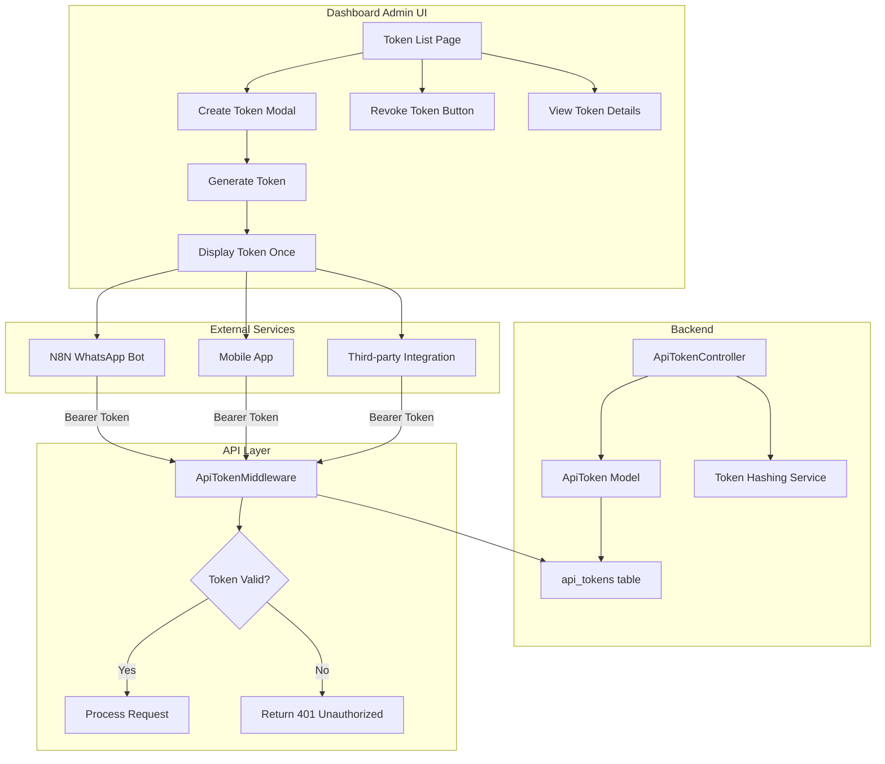

# API Token Management System - Implementation Plan

## Overview

This plan creates a comprehensive API Token Management system with a user-friendly admin interface for the Kecamatan Besuk Dashboard. The system will allow Super Admins to create, view, revoke, and manage API tokens for external integrations like N8N WhatsApp Bot.

## Architecture



## Database Schema

### Table: `api_tokens`

| Column | Type | Description |
|--------|------|-------------|
| id | bigint | Primary key |
| user_id | foreignId | Creator (Super Admin) |
| name | string | Token name/description |
| token | string(64) | Hashed token (unique) |
| plain_token | text | NULL (never stored) |
| abilities | json | Token permissions |
| last_used_at | timestamp | Last API call |
| expires_at | timestamp | Optional expiration |
| revoked_at | timestamp | Soft delete for revocation |
| created_at | timestamp | Creation time |
| updated_at | timestamp | Update time |

### Migration File

```php
<?php
// database/migrations/2026_02_16_000004_create_api_tokens_table.php

use Illuminate\Database\Migrations\Migration;
use Illuminate\Database\Schema\Blueprint;
use Illuminate\Support\Facades\Schema;

return new class extends Migration
{
    public function up(): void
    {
        Schema::create('api_tokens', function (Blueprint $table) {
            $table->id();
            $table->foreignId('user_id')->constrained()->onDelete('cascade');
            $table->string('name');
            $table->string('token', 64)->unique();
            $table->json('abilities')->nullable();
            $table->timestamp('last_used_at')->nullable();
            $table->timestamp('expires_at')->nullable();
            $table->timestamp('revoked_at')->nullable();
            $table->timestamps();
            
            $table->index(['token', 'revoked_at']);
            $table->index('user_id');
        });
    }

    public function down(): void
    {
        Schema::dropIfExists('api_tokens');
    }
};
```

## Components

### 1. ApiToken Model

**File:** `app/Models/ApiToken.php`

```php
<?php

namespace App\Models;

use Illuminate\Database\Eloquent\Factories\HasFactory;
use Illuminate\Database\Eloquent\Model;
use Illuminate\Support\Str;

class ApiToken extends Model
{
    use HasFactory;

    protected $fillable = [
        'user_id',
        'name',
        'token',
        'abilities',
        'last_used_at',
        'expires_at',
        'revoked_at',
    ];

    protected $hidden = [
        'token',
    ];

    protected $casts = [
        'abilities' => 'array',
        'last_used_at' => 'datetime',
        'expires_at' => 'datetime',
        'revoked_at' => 'datetime',
    ];

    // Available abilities
    const ABILITIES = [
        'umkm-read' => 'Read UMKM data',
        'umkm-write' => 'Create/Update UMKM data',
        'loker-read' => 'Read job vacancies',
        'loker-write' => 'Create/Update job vacancies',
        'faq-read' => 'Read FAQ data',
        'faq-write' => 'Create/Update FAQ data',
        'complaint-read' => 'Read complaints',
        'complaint-write' => 'Create complaints',
        'owner-verify' => 'Verify owner PIN',
        'owner-toggle' => 'Toggle listing status',
    ];

    public function user()
    {
        return $this->belongsTo(User::class);
    }

    public function isRevoked(): bool
    {
        return !is_null($this->revoked_at);
    }

    public function isExpired(): bool
    {
        return !is_null($this->expires_at) && $this->expires_at->isPast();
    }

    public function isValid(): bool
    {
        return !$this->isRevoked() && !$this->isExpired();
    }

    public function can(string $ability): bool
    {
        if (is_null($this->abilities)) {
            return true; // No restrictions
        }
        return in_array($ability, $this->abilities) || in_array('*', $this->abilities);
    }

    public static function generateTokenString(): string
    {
        return Str::random(64);
    }

    public static function hashToken(string $plainToken): string
    {
        return hash('sha256', $plainToken);
    }
}
```

### 2. ApiTokenController

**File:** `app/Http/Controllers/ApiTokenController.php`

```php
<?php

namespace App\Http\Controllers;

use App\Models\ApiToken;
use Illuminate\Http\Request;
use Illuminate\Support\Str;

class ApiTokenController extends Controller
{
    public function __construct()
    {
        $this->middleware(function ($request, $next) {
            if (!auth()->user()->isSuperAdmin()) {
                abort(403, 'Unauthorized. Only Super Admin can manage API tokens.');
            }
            return $next($request);
        });
    }

    public function index()
    {
        $tokens = ApiToken::with('user')
            ->orderBy('created_at', 'desc')
            ->paginate(10);

        return view('kecamatan.settings.api-tokens.index', compact('tokens'));
    }

    public function create()
    {
        $abilities = ApiToken::ABILITIES;
        return view('kecamatan.settings.api-tokens.create', compact('abilities'));
    }

    public function store(Request $request)
    {
        $validated = $request->validate([
            'name' => 'required|string|max:255',
            'abilities' => 'nullable|array',
            'abilities.*' => 'string|in:' . implode(',', array_keys(ApiToken::ABILITIES)),
            'expires_at' => 'nullable|date|after:now',
        ]);

        // Generate plain token
        $plainToken = ApiToken::generateTokenString();
        $hashedToken = ApiToken::hashToken($plainToken);

        $token = ApiToken::create([
            'user_id' => auth()->id(),
            'name' => $validated['name'],
            'token' => $hashedToken,
            'abilities' => $validated['abilities'] ?? null,
            'expires_at' => $validated['expires_at'] ?? null,
        ]);

        // Return with plain token (only shown once!)
        return redirect()
            ->route('kecamatan.settings.api-tokens.show', $token)
            ->with('plain_token', $plainToken)
            ->with('success', 'Token created successfully. Copy the token now - it will not be shown again!');
    }

    public function show(ApiToken $apiToken)
    {
        $plainToken = session('plain_token');
        return view('kecamatan.settings.api-tokens.show', compact('apiToken', 'plainToken'));
    }

    public function revoke(ApiToken $apiToken)
    {
        $apiToken->update(['revoked_at' => now()]);

        return redirect()
            ->route('kecamatan.settings.api-tokens.index')
            ->with('success', 'Token revoked successfully.');
    }

    public function destroy(ApiToken $apiToken)
    {
        $apiToken->delete();

        return redirect()
            ->route('kecamatan.settings.api-tokens.index')
            ->with('success', 'Token deleted permanently.');
    }
}
```

### 3. Updated ApiTokenMiddleware

**File:** `app/Http/Middleware/ApiTokenMiddleware.php`

```php
<?php

namespace App\Http\Middleware;

use App\Models\ApiToken;
use Closure;
use Illuminate\Http\Request;
use Symfony\Component\HttpFoundation\Response;

class ApiTokenMiddleware
{
    public function handle(Request $request, Closure $next, string $ability = null): Response
    {
        $token = $request->bearerToken();

        if (empty($token)) {
            return response()->json([
                'success' => false,
                'message' => 'Unauthorized. No API token provided.'
            ], 401);
        }

        // Hash the incoming token
        $hashedToken = ApiToken::hashToken($token);

        // Find token in database
        $apiToken = ApiToken::where('token', $hashedToken)->first();

        // Check if token exists and is valid
        if (!$apiToken || !$apiToken->isValid()) {
            \Log::warning('Invalid or revoked API token used', [
                'ip' => $request->ip(),
                'path' => $request->path()
            ]);

            return response()->json([
                'success' => false,
                'message' => 'Unauthorized. Invalid or revoked API token.'
            ], 401);
        }

        // Check ability if specified
        if ($ability && !$apiToken->can($ability)) {
            return response()->json([
                'success' => false,
                'message' => 'Forbidden. Token lacks required ability: ' . $ability
            ], 403);
        }

        // Update last used timestamp
        $apiToken->update(['last_used_at' => now()]);

        // Add token to request for controllers
        $request->attributes->set('api_token', $apiToken);

        return $next($request);
    }
}
```

### 4. Routes

**File:** `routes/kecamatan.php` (add to existing)

```php
// API Token Management (Super Admin only)
Route::prefix('settings/api-tokens')->name('settings.api-tokens.')->group(function () {
    Route::get('/', [ApiTokenController::class, 'index'])->name('index');
    Route::get('/create', [ApiTokenController::class, 'create'])->name('create');
    Route::post('/', [ApiTokenController::class, 'store'])->name('store');
    Route::get('/{apiToken}', [ApiTokenController::class, 'show'])->name('show');
    Route::put('/{apiToken}/revoke', [ApiTokenController::class, 'revoke'])->name('revoke');
    Route::delete('/{apiToken}', [ApiTokenController::class, 'destroy'])->name('destroy');
});
```

**File:** `routes/api.php` (update existing)

```php
// Update middleware to use new token system with abilities
Route::middleware(['throttle:60,1', 'api.token:umkm-read'])->group(function () {
    Route::get('/umkm/search', [ExternalApiController::class, 'searchUmkm']);
    Route::get('/jasa/search', [ExternalApiController::class, 'searchJasa']);
});

Route::middleware(['throttle:60,1', 'api.token:loker-read'])->group(function () {
    Route::get('/loker/search', [ExternalApiController::class, 'searchLoker']);
});

Route::middleware(['throttle:60,1', 'api.token:faq-read'])->group(function () {
    Route::get('/faq/search', [ExternalApiController::class, 'searchFaq']);
});

Route::middleware(['throttle:60,1', 'api.token:owner-verify'])->group(function () {
    Route::post('/owner/verify-pin', [ExternalApiController::class, 'verifyOwnerPin']);
    Route::post('/owner/toggle-listing', [ExternalApiController::class, 'toggleListing'])
        ->middleware('api.token:owner-toggle');
});

Route::middleware(['throttle:60,1', 'api.token:complaint-write'])->group(function () {
    Route::post('/complaint/pending', [ExternalApiController::class, 'storePendingComplaint']);
    Route::post('/complaint/confirm', [ExternalApiController::class, 'confirmComplaint']);
    Route::post('/complaint/cancel', [ExternalApiController::class, 'cancelComplaint']);
});
```

## Blade Views

### 1. Token List View

**File:** `resources/views/kecamatan/settings/api-tokens/index.blade.php`

```blade
@extends('layouts.kecamatan')

@section('content')
<div class="container-fluid py-4">
    <div class="d-flex justify-content-between align-items-center mb-4">
        <div>
            <h4 class="mb-1">
                <i class="fas fa-key me-2"></i>Manajemen API Token
            </h4>
            <p class="text-muted mb-0">Kelola token akses untuk integrasi eksternal</p>
        </div>
        <a href="{{ route('kecamatan.settings.api-tokens.create') }}" class="btn btn-primary">
            <i class="fas fa-plus me-2"></i>Buat Token Baru
        </a>
    </div>

    @if(session('success'))
    <div class="alert alert-success alert-dismissible fade show" role="alert">
        {{ session('success') }}
        <button type="button" class="btn-close" data-bs-dismiss="alert"></button>
    </div>
    @endif

    <div class="card shadow-sm">
        <div class="card-body p-0">
            <div class="table-responsive">
                <table class="table table-hover mb-0">
                    <thead class="table-light">
                        <tr>
                            <th>Nama Token</th>
                            <th>Dibuat Oleh</th>
                            <th>Abilities</th>
                            <th>Terakhir Digunakan</th>
                            <th>Kedaluwarsa</th>
                            <th>Status</th>
                            <th class="text-end">Aksi</th>
                        </tr>
                    </thead>
                    <tbody>
                        @forelse($tokens as $token)
                        <tr>
                            <td>
                                <strong>{{ $token->name }}</strong>
                                <br><small class="text-muted">{{ $token->created_at->format('d M Y H:i') }}</small>
                            </td>
                            <td>{{ $token->user->nama_lengkap }}</td>
                            <td>
                                @if($token->abilities)
                                    @foreach($token->abilities as $ability)
                                        <span class="badge bg-info me-1">{{ $ability }}</span>
                                    @endforeach
                                @else
                                    <span class="badge bg-secondary">Full Access</span>
                                @endif
                            </td>
                            <td>
                                @if($token->last_used_at)
                                    {{ $token->last_used_at->diffForHumans() }}
                                @else
                                    <span class="text-muted">Belum pernah</span>
                                @endif
                            </td>
                            <td>
                                @if($token->expires_at)
                                    {{ $token->expires_at->format('d M Y') }}
                                @else
                                    <span class="text-muted">Tidak ada</span>
                                @endif
                            </td>
                            <td>
                                @if($token->isRevoked())
                                    <span class="badge bg-danger">Dicabut</span>
                                @elseif($token->isExpired())
                                    <span class="badge bg-warning text-dark">Kedaluwarsa</span>
                                @else
                                    <span class="badge bg-success">Aktif</span>
                                @endif
                            </td>
                            <td class="text-end">
                                @if($token->isValid())
                                <form action="{{ route('kecamatan.settings.api-tokens.revoke', $token) }}" 
                                      method="POST" class="d-inline" 
                                      onsubmit="return confirm('Cabut token ini?')">
                                    @csrf @method('PUT')
                                    <button type="submit" class="btn btn-sm btn-outline-warning">
                                        <i class="fas fa-ban"></i> Cabut
                                    </button>
                                </form>
                                @endif
                                <form action="{{ route('kecamatan.settings.api-tokens.destroy', $token) }}" 
                                      method="POST" class="d-inline"
                                      onsubmit="return confirm('Hapus token secara permanen?')">
                                    @csrf @method('DELETE')
                                    <button type="submit" class="btn btn-sm btn-outline-danger">
                                        <i class="fas fa-trash"></i>
                                    </button>
                                </form>
                            </td>
                        </tr>
                        @empty
                        <tr>
                            <td colspan="7" class="text-center py-5">
                                <i class="fas fa-key fa-3x text-muted mb-3"></i>
                                <p class="text-muted mb-0">Belum ada API token</p>
                            </td>
                        </tr>
                        @endforelse
                    </tbody>
                </table>
            </div>
        </div>
    </div>

    {{ $tokens->links() }}
</div>
@endsection
```

### 2. Create Token View

**File:** `resources/views/kecamatan/settings/api-tokens/create.blade.php`

```blade
@extends('layouts.kecamatan')

@section('content')
<div class="container-fluid py-4">
    <div class="row justify-content-center">
        <div class="col-lg-8">
            <div class="card shadow-sm">
                <div class="card-header bg-white">
                    <h5 class="mb-0">
                        <i class="fas fa-plus-circle me-2"></i>Buat API Token Baru
                    </h5>
                </div>
                <div class="card-body">
                    <form action="{{ route('kecamatan.settings.api-tokens.store') }}" method="POST">
                        @csrf

                        <div class="mb-4">
                            <label for="name" class="form-label">Nama Token <span class="text-danger">*</span></label>
                            <input type="text" class="form-control @error('name') is-invalid @enderror" 
                                   id="name" name="name" value="{{ old('name') }}" 
                                   placeholder="Contoh: N8N WhatsApp Bot">
                            @error('name')
                            <div class="invalid-feedback">{{ $message }}</div>
                            @enderror
                            <small class="text-muted">Beri nama deskriptif untuk mengidentifikasi penggunaan token</small>
                        </div>

                        <div class="mb-4">
                            <label class="form-label">Abilities (Izin Akses)</label>
                            <small class="text-muted d-block mb-2">Pilih izin yang diperlukan. Kosongkan untuk akses penuh.</small>
                            
                            <div class="row">
                                @foreach($abilities as $key => $description)
                                <div class="col-md-6 mb-2">
                                    <div class="form-check">
                                        <input class="form-check-input" type="checkbox" 
                                               name="abilities[]" value="{{ $key }}" 
                                               id="ability_{{ $key }}"
                                               @checked(in_array($key, old('abilities', [])))>
                                        <label class="form-check-label" for="ability_{{ $key }}">
                                            <strong>{{ $key }}</strong>
                                            <br><small class="text-muted">{{ $description }}</small>
                                        </label>
                                    </div>
                                </div>
                                @endforeach
                            </div>
                        </div>

                        <div class="mb-4">
                            <label for="expires_at" class="form-label">Tanggal Kedaluwarsa (Opsional)</label>
                            <input type="datetime-local" class="form-control @error('expires_at') is-invalid @enderror" 
                                   id="expires_at" name="expires_at" value="{{ old('expires_at') }}">
                            @error('expires_at')
                            <div class="invalid-feedback">{{ $message }}</div>
                            @enderror
                            <small class="text-muted">Kosongkan untuk token tanpa batas waktu</small>
                        </div>

                        <div class="alert alert-warning">
                            <i class="fas fa-exclamation-triangle me-2"></i>
                            <strong>Penting:</strong> Token hanya akan ditampilkan sekali setelah dibuat. 
                            Pastikan untuk menyalin dan menyimpan token dengan aman.
                        </div>

                        <div class="d-flex gap-2">
                            <button type="submit" class="btn btn-primary">
                                <i class="fas fa-key me-2"></i>Generate Token
                            </button>
                            <a href="{{ route('kecamatan.settings.api-tokens.index') }}" class="btn btn-secondary">
                                Batal
                            </a>
                        </div>
                    </form>
                </div>
            </div>
        </div>
    </div>
</div>
@endsection
```

### 3. Show Token View (with one-time display)

**File:** `resources/views/kecamatan/settings/api-tokens/show.blade.php`

```blade
@extends('layouts.kecamatan')

@section('content')
<div class="container-fluid py-4">
    <div class="row justify-content-center">
        <div class="col-lg-8">
            @if($plainToken)
            <!-- One-time token display -->
            <div class="alert alert-success mb-4">
                <h5 class="alert-heading">
                    <i class="fas fa-check-circle me-2"></i>Token Berhasil Dibuat!
                </h5>
                <p>Salin token di bawah ini dan simpan dengan aman. Token ini <strong>tidak akan ditampilkan lagi</strong>.</p>
            </div>

            <div class="card border-success mb-4">
                <div class="card-header bg-success text-white">
                    <i class="fas fa-key me-2"></i>API Token Anda
                </div>
                <div class="card-body">
                    <div class="input-group">
                        <input type="text" class="form-control form-control-lg font-monospace" 
                               id="tokenDisplay" value="{{ $plainToken }}" readonly>
                        <button class="btn btn-success" type="button" onclick="copyToken()">
                            <i class="fas fa-copy me-2"></i>Salin
                        </button>
                    </div>
                </div>
            </div>

            <div class="alert alert-info">
                <h6 class="alert-heading"><i class="fas fa-info-circle me-2"></i>Cara Penggunaan</h6>
                <p class="mb-2">Gunakan token ini sebagai Bearer Token di header request API:</p>
                <pre class="mb-0 bg-dark text-light p-3 rounded"><code>Authorization: Bearer {{ $plainToken }}</code></pre>
            </div>
            @endif

            <div class="card shadow-sm">
                <div class="card-header bg-white">
                    <h5 class="mb-0">
                        <i class="fas fa-info-circle me-2"></i>Detail Token
                    </h5>
                </div>
                <div class="card-body">
                    <table class="table table-borderless">
                        <tr>
                            <td class="fw-bold" style="width: 200px;">Nama</td>
                            <td>{{ $apiToken->name }}</td>
                        </tr>
                        <tr>
                            <td class="fw-bold">Dibuat Oleh</td>
                            <td>{{ $apiToken->user->nama_lengkap }}</td>
                        </tr>
                        <tr>
                            <td class="fw-bold">Dibuat Pada</td>
                            <td>{{ $apiToken->created_at->format('d M Y H:i:s') }}</td>
                        </tr>
                        <tr>
                            <td class="fw-bold">Abilities</td>
                            <td>
                                @if($apiToken->abilities)
                                    @foreach($apiToken->abilities as $ability)
                                        <span class="badge bg-info me-1">{{ $ability }}</span>
                                    @endforeach
                                @else
                                    <span class="badge bg-secondary">Full Access</span>
                                @endif
                            </td>
                        </tr>
                        <tr>
                            <td class="fw-bold">Kedaluwarsa</td>
                            <td>
                                @if($apiToken->expires_at)
                                    {{ $apiToken->expires_at->format('d M Y H:i:s') }}
                                @else
                                    <span class="text-muted">Tidak ada batas waktu</span>
                                @endif
                            </td>
                        </tr>
                        <tr>
                            <td class="fw-bold">Status</td>
                            <td>
                                <span class="badge bg-success">Aktif</span>
                            </td>
                        </tr>
                    </table>
                </div>
                <div class="card-footer bg-white">
                    <a href="{{ route('kecamatan.settings.api-tokens.index') }}" class="btn btn-secondary">
                        <i class="fas fa-arrow-left me-2"></i>Kembali ke Daftar
                    </a>
                </div>
            </div>
        </div>
    </div>
</div>

@push('scripts')
<script>
function copyToken() {
    const tokenInput = document.getElementById('tokenDisplay');
    tokenInput.select();
    document.execCommand('copy');
    
    // Show feedback
    const btn = event.target.closest('button');
    const originalHtml = btn.innerHTML;
    btn.innerHTML = '<i class="fas fa-check me-2"></i>Disalin!';
    btn.classList.remove('btn-success');
    btn.classList.add('btn-secondary');
    
    setTimeout(() => {
        btn.innerHTML = originalHtml;
        btn.classList.remove('btn-secondary');
        btn.classList.add('btn-success');
    }, 2000);
}
</script>
@endpush
@endsection
```

## Sidebar Integration

Add to existing sidebar (e.g., `resources/views/layouts/partials/sidebar/kecamatan.blade.php`):

```blade
@if(auth()->user()->isSuperAdmin())
<div class="nav-section">
    <span class="nav-section-title">PENGATURAN SISTEM</span>
    <ul class="nav-menu">
        <!-- Existing items -->
        <li class="nav-item">
            <a href="{{ route('kecamatan.settings.api-tokens.index') }}"
               class="nav-link {{ request()->routeIs('kecamatan.settings.api-tokens.*') ? 'active' : '' }}">
                <span class="nav-icon"><i class="fas fa-key"></i></span>
                <span class="nav-text">API Tokens</span>
            </a>
        </li>
    </ul>
</div>
@endif
```

## Security Considerations

1. **Token Hashing**: Tokens are stored as SHA-256 hashes, never in plain text
2. **One-time Display**: Plain token is shown only once upon creation
3. **Ability Scoping**: Tokens can be restricted to specific operations
4. **Revocation**: Tokens can be revoked without deletion for audit trail
5. **Expiration**: Optional expiration dates for temporary access
6. **Audit Trail**: Last used timestamp for monitoring

## Testing Plan

### Manual Testing Steps

1. **Create Token**
   - Login as Super Admin
   - Navigate to Settings > API Tokens
   - Click "Buat Token Baru"
   - Fill name, select abilities, set expiration
   - Submit and verify token is displayed
   - Copy token and verify it works

2. **Use Token**
   ```bash
   curl -H "Authorization: Bearer YOUR_TOKEN" \
        http://localhost:8001/api/umkm/search?q=test
   ```
   - Verify response is successful
   - Check last_used_at is updated

3. **Revoke Token**
   - Click "Cabut" button on token list
   - Verify token is marked as revoked
   - Try using token again - should return 401

4. **Ability Check**
   - Create token with only `umkm-read` ability
   - Try accessing `/loker/search` - should return 403
   - Try accessing `/umkm/search` - should succeed

## Implementation Checklist

- [ ] Create migration for `api_tokens` table
- [ ] Create `ApiToken` model
- [ ] Create `ApiTokenController`
- [ ] Create Blade views (index, create, show)
- [ ] Update `ApiTokenMiddleware`
- [ ] Add routes to `kecamatan.php`
- [ ] Update API routes in `api.php`
- [ ] Add sidebar menu item
- [ ] Run migration
- [ ] Test token creation
- [ ] Test token validation
- [ ] Test token revocation
- [ ] Test ability restrictions

## Estimated Files Changed

| Component | Files | Lines |
|-----------|-------|-------|
| Migration | 1 | ~30 |
| Model | 1 | ~80 |
| Controller | 1 | ~100 |
| Middleware | 1 | ~50 |
| Routes | 2 | ~30 |
| Views | 3 | ~300 |
| Sidebar | 1 | ~10 |
| **Total** | **10** | **~600** |