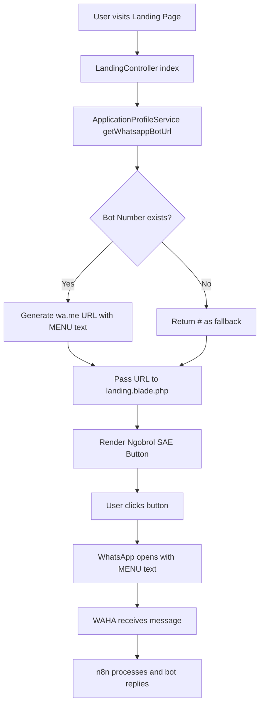

# Implementation Plan: Ngobrol SAE WhatsApp Button

## Overview
Replace the existing "Sampaikan Layanan / Pengaduan" button on the landing page with a "Ngobrol SAE" WhatsApp button that directly opens WhatsApp to the WAHA bot number.

## Current State Analysis

### Existing Infrastructure
1. **AppProfile Model** ([`AppProfile.php`](dashboard-kecamatan/app/Models/AppProfile.php)) - Already has `whatsapp_bot_number` field
2. **ApplicationProfileService** ([`ApplicationProfileService.php`](dashboard-kecamatan/app/Services/ApplicationProfileService.php:100)) - Already has:
   - `getWhatsappBotNumber()` method
   - `getWhatsappBotUrl($text)` method that generates `https://wa.me/{number}?text={text}`
3. **Helper Function** ([`profile_helper.php`](dashboard-kecamatan/app/Helpers/profile_helper.php)) - `appProfile()` helper available globally

### Current Button Location
- File: [`landing.blade.php`](dashboard-kecamatan/resources/views/landing.blade.php:268-272)
- Current implementation uses a button that opens a modal:
```html
<button onclick="document.getElementById('publicServiceModal').showDialog()"
    class="btn bg-[#0d9488] hover:bg-[#0f766e] text-white border-0 rounded-2xl px-10 font-bold shadow-xl transition-all h-14">
    Sampaikan Layanan / Pengaduan
</button>
```

## Implementation Steps

### Step 1: Update LandingController
**File:** [`LandingController.php`](dashboard-kecamatan/app/Http/Controllers/LandingController.php)

Add WhatsApp URL generation in the `index()` method:

```php
// Add after line 76 (after $heroImageAlt)
$whatsappUrl = $profileService->getWhatsappBotUrl('MENU');
```

Then add `$whatsappUrl` to the compact array in the return statement.

### Step 2: Update Landing Blade View
**File:** [`landing.blade.php`](dashboard-kecamatan/resources/views/landing.blade.php)

Replace the existing button (lines 268-272) with:

```html
<a href="{{ $whatsappUrl }}"
   target="_blank"
   rel="noopener noreferrer"
   class="btn bg-[#25D366] hover:bg-[#128C7E] text-white border-0 rounded-2xl px-10 font-bold shadow-xl transition-all h-14 inline-flex items-center gap-2">
    <svg xmlns="http://www.w3.org/2000/svg" class="w-5 h-5" viewBox="0 0 24 24" fill="currentColor">
        <path d="M17.472 14.382c-.297-.149-1.758-.867-2.03-.967-.273-.099-.471-.148-.67.15-.197.297-.767.966-.94 1.164-.173.199-.347.223-.644.075-.297-.15-1.255-.463-2.39-1.475-.883-.788-1.48-1.761-1.653-2.059-.173-.297-.018-.458.13-.606.134-.133.298-.347.446-.52.149-.174.198-.298.298-.497.099-.198.05-.371-.025-.52-.075-.149-.669-1.612-.916-2.207-.242-.579-.487-.5-.669-.51-.173-.008-.371-.01-.57-.01-.198 0-.52.074-.792.372-.272.297-1.04 1.016-1.04 2.479 0 1.462 1.065 2.875 1.213 3.074.149.198 2.096 3.2 5.077 4.487.709.306 1.262.489 1.694.625.712.227 1.36.195 1.871.118.571-.085 1.758-.719 2.006-1.413.248-.694.248-1.289.173-1.413-.074-.124-.272-.198-.57-.347m-5.421 7.403h-.004a9.87 9.87 0 01-5.031-1.378l-.361-.214-3.741.982.998-3.648-.235-.374a9.86 9.86 0 01-1.51-5.26c.001-5.45 4.436-9.884 9.888-9.884 2.64 0 5.122 1.03 6.988 2.898a9.825 9.825 0 012.893 6.994c-.003 5.45-4.437 9.884-9.885 9.884m8.413-18.297A11.815 11.815 0 0012.05 0C5.495 0 .16 5.335.157 11.892c0 2.096.547 4.142 1.588 5.945L.057 24l6.305-1.654a11.882 11.882 0 005.683 1.448h.005c6.554 0 11.89-5.335 11.893-11.893a11.821 11.821 0 00-3.48-8.413z"/>
    </svg>
    Ngobrol SAE bareng Kecamatan Besuk
</a>
<p class="text-muted mt-2 text-sm text-slate-500">
    Tanya layanan, cek berkas, UMKM, lowongan kerja, dan pengaduan dengan mudah.
</p>
```

### Step 3: Update WhatsApp Settings Seeder
**File:** [`WhatsAppSettingsSeeder.php`](dashboard-kecamatan/database/seeders/WhatsAppSettingsSeeder.php)

Update the bot number value from `6281234567890` to `6281331699112`:

```php
[
    'module' => 'whatsapp',
    'key' => 'whatsapp_bot_number',
    'value' => '6281331699112', // Updated to actual WAHA bot number
    'description' => 'Official WhatsApp bot number for Kecamatan Besuk',
    'type' => 'text',
],
```

### Step 4: Ensure AppProfile has the Bot Number
The admin should set the `whatsapp_bot_number` in the AppProfile settings. This can be done via:
- Admin panel settings page
- Or direct database update

## Architecture Diagram



## Anti-Freeze Protection Checklist

| Requirement | Status | Notes |
|-------------|--------|-------|
| No additional JS | ✅ | Pure anchor link |
| No Alpine.js | ✅ | Not used |
| No event listeners | ✅ | Native HTML link |
| No AJAX calls | ✅ | Direct link |
| No DOM manipulation | ✅ | Static HTML |
| No footer scripts | ✅ | None added |
| No conflict with chatbox | ✅ | Separate component |
| No conflict with voice guide | ✅ | Independent |

## Database Consistency

The WhatsApp bot number must be consistent across:
1. **app_profiles.whatsapp_bot_number** - Used by ApplicationProfileService
2. **module_settings** (whatsapp.whatsapp_bot_number) - Used by WhatsApp module
3. **WAHA session default** - The actual WhatsApp number configured in WAHA

## Files to Modify

| File | Change Type | Description |
|------|-------------|-------------|
| `LandingController.php` | Modify | Add WhatsApp URL generation |
| `landing.blade.php` | Modify | Replace button with anchor link |
| `WhatsAppSettingsSeeder.php` | Modify | Update bot number |

## Testing Checklist

- [ ] Verify bot number is set in app_profiles table
- [ ] Verify button appears on landing page
- [ ] Click button opens WhatsApp with correct number
- [ ] MENU text is pre-filled in WhatsApp
- [ ] No JavaScript errors in console
- [ ] No conflicts with existing modals/chatbox
- [ ] Mobile responsive button display

## Rollback Plan

If issues arise, revert to original button:
```html
<button onclick="document.getElementById('publicServiceModal').showModal()"
    class="btn bg-[#0d9488] hover:bg-[#0f766e] text-white border-0 rounded-2xl px-10 font-bold shadow-xl transition-all h-14">
    Sampaikan Layanan / Pengaduan
</button>
```
