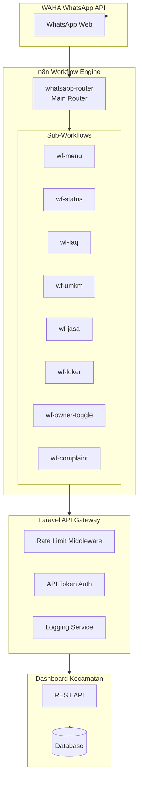
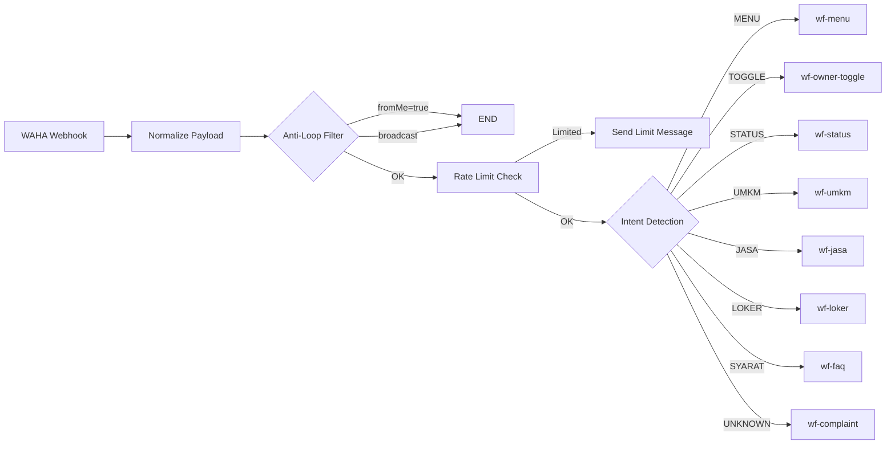

# WhatsApp Automation System v4 - Implementation Plan

## 📋 Executive Summary

This document outlines the implementation plan for a production-ready WhatsApp Automation System for Kecamatan Besuk. The system uses a modular architecture with n8n workflows, ensuring security, scalability, and maintainability.

## 🎯 Objectives

- ✔ Modular workflow architecture
- ✔ Safe for public access
- ✔ No inbox spam (confirmation-based complaints)
- ✔ No data leakage between modules
- ✔ Scalable design
- ✔ Easy debugging
- ✔ AI-ready for future integration

---

## 🏗️ Architecture Overview



---

## 📁 Project Structure

```
whatsapp/
├── docker-compose.yml           # WAHA + n8n containers
├── .env                         # Environment configuration
├── laravel-api/                 # API Gateway
│   ├── app/
│   │   ├── Http/
│   │   │   ├── Controllers/
│   │   │   │   ├── WebhookController.php
│   │   │   │   ├── OwnerController.php      # NEW
│   │   │   │   └── ComplaintController.php  # NEW
│   │   │   └── Middleware/
│   │   │       └── RateLimitMiddleware.php  # NEW
│   │   └── Services/
│   │       ├── DashboardApiService.php
│   │       ├── RateLimitService.php         # NEW
│   │       └── PhoneMaskService.php         # NEW
│   └── routes/
│       └── api.php
├── n8n-workflows/               # Modular workflows
│   ├── whatsapp-router.json     # Main router
│   ├── wf-menu.json             # Menu workflow
│   ├── wf-status.json           # Status check
│   ├── wf-faq.json              # FAQ search
│   ├── wf-umkm.json             # UMKM search
│   ├── wf-jasa.json             # Jasa search
│   ├── wf-loker.json            # Loker search
│   ├── wf-owner-toggle.json     # Owner toggle with PIN
│   └── wf-complaint.json        # Complaint with confirmation
└── docs/
    ├── API_ENDPOINTS.md         # API documentation
    ├── WORKFLOW_GUIDE.md        # Workflow guide
    └── DEPLOYMENT.md            # Deployment guide
```

---

## 🔧 Phase 1: API Gateway Enhancement

### 1.1 Rate Limiting Middleware

**File:** `whatsapp/laravel-api/app/Http/Middleware/RateLimitMiddleware.php`

```php
<?php

namespace App\Http\Middleware;

use App\Services\RateLimitService;
use Closure;

class RateLimitMiddleware
{
    private const MAX_REQUESTS = 10;  // requests per minute
    private const WINDOW_SECONDS = 60;

    public function handle($request, Closure $next)
    {
        $phone = $request->input('phone') 
              ?? $request->input('chatId') 
              ?? $request->ip();

        $rateLimitService = new RateLimitService();
        
        if ($rateLimitService->isRateLimited($phone, self::MAX_REQUESTS, self::WINDOW_SECONDS)) {
            return response()->json([
                'success' => false,
                'message' => 'Terlalu banyak permintaan. Silakan coba lagi dalam 1 menit.',
                'retry_after' => $rateLimitService->getRetryAfter($phone)
            ], 429);
        }

        $rateLimitService->increment($phone);

        return $next($request);
    }
}
```

### 1.2 Rate Limit Service

**File:** `whatsapp/laravel-api/app/Services/RateLimitService.php`

```php
<?php

namespace App\Services;

class RateLimitService
{
    private string $cachePath;

    public function __construct()
    {
        $this->cachePath = __DIR__ . '/../../storage/framework/rate_limits';
        if (!is_dir($this->cachePath)) {
            mkdir($this->cachePath, 0777, true);
        }
    }

    public function isRateLimited(string $identifier, int $maxRequests, int $window): bool
    {
        $key = md5($identifier);
        $file = $this->cachePath . '/' . $key . '.json';
        
        if (!file_exists($file)) {
            return false;
        }

        $data = json_decode(file_get_contents($file), true);
        
        // Reset if window expired
        if (time() - $data['start_time'] > $window) {
            return false;
        }

        return $data['count'] >= $maxRequests;
    }

    public function increment(string $identifier): void
    {
        $key = md5($identifier);
        $file = $this->cachePath . '/' . $key . '.json';
        
        if (file_exists($file)) {
            $data = json_decode(file_get_contents($file), true);
            if (time() - $data['start_time'] <= 60) {
                $data['count']++;
            } else {
                $data = ['count' => 1, 'start_time' => time()];
            }
        } else {
            $data = ['count' => 1, 'start_time' => time()];
        }

        file_put_contents($file, json_encode($data));
    }

    public function getRetryAfter(string $identifier): int
    {
        $key = md5($identifier);
        $file = $this->cachePath . '/' . $key . '.json';
        
        if (!file_exists($file)) {
            return 0;
        }

        $data = json_decode(file_get_contents($file), true);
        return max(0, 60 - (time() - $data['start_time']));
    }
}
```

### 1.3 Phone Masking Service

**File:** `whatsapp/laravel-api/app/Services/PhoneMaskService.php`

```php
<?php

namespace App\Services;

class PhoneMaskService
{
    /**
     * Mask phone number for public display
     * Example: 6281234567890 -> 62812****7890
     */
    public static function mask(string $phone, int $visibleStart = 4, int $visibleEnd = 4): string
    {
        $phone = preg_replace('/[^0-9]/', '', $phone);
        $length = strlen($phone);
        
        if ($length <= $visibleStart + $visibleEnd) {
            return $phone;
        }

        $start = substr($phone, 0, $visibleStart);
        $end = substr($phone, -$visibleEnd);
        $masked = str_repeat('*', $length - $visibleStart - $visibleEnd);

        return $start . $masked . $end;
    }

    /**
     * Generate WhatsApp link
     */
    public static function generateWaLink(string $phone, ?string $message = null): string
    {
        $phone = preg_replace('/[^0-9]/', '', $phone);
        $link = "https://wa.me/{$phone}";
        
        if ($message) {
            $link .= '?text=' . urlencode($message);
        }

        return $link;
    }
}
```

---

## 🔧 Phase 2: n8n Modular Workflows

### 2.1 Main Router Workflow

**File:** `whatsapp/n8n-workflows/whatsapp-router.json`

The main router handles:
1. Webhook reception from WAHA
2. Payload normalization
3. Anti-loop filtering
4. Rate limiting check
5. Intent detection
6. Sub-workflow execution



### 2.2 Intent Detection Priority

| Priority | Intent | Keywords |
|----------|--------|----------|
| 1 | MENU | menu, bantuan, help, mulai, start |
| 2 | TOGGLE | tutup lapak, buka lapak |
| 3 | STATUS | status, cek berkas, nomor berkas |
| 4 | UMKM | umkm, produk, kerupuk, makanan, usaha |
| 5 | JASA | jasa, tukang, servis, service |
| 6 | LOKER | loker, lowongan, kerja, pekerjaan |
| 7 | SYARAT | syarat, ketentuan, prosedur, cara |
| 8 | UNKNOWN | *everything else* |

### 2.3 Sub-Workflow Specifications

#### wf-menu
- **Purpose:** Send static menu
- **API Calls:** None
- **Response:** Formatted menu text

#### wf-status
- **Purpose:** Check document status
- **API Calls:** `POST /api/cek-berkas`
- **Response:** Status details or not found message
- **Ticket Creation:** ❌ No

#### wf-faq
- **Purpose:** Search FAQ
- **API Calls:** `POST /api/faq`
- **Response:** FAQ answer or confirmation prompt
- **Ticket Creation:** ❌ No (only with confirmation)

#### wf-umkm
- **Purpose:** Search UMKM products
- **API Calls:** `GET /api/umkm/search`
- **Filters:** `is_active=true`, `is_verified=true`, `is_flagged=false`
- **Limit:** 5 results
- **Response:** Product list with masked phone numbers
- **Ticket Creation:** ❌ No

#### wf-jasa
- **Purpose:** Search services
- **API Calls:** `GET /api/jasa/search`
- **Filters:** `status=aktif`, `verified=true`, `flagged=false`
- **Response:** Service list with masked phone numbers
- **Ticket Creation:** ❌ No

#### wf-loker
- **Purpose:** Search job vacancies
- **API Calls:** `GET /api/loker/search`
- **Filters:** `status=aktif`, NOT jasa category
- **Response:** Job list
- **Ticket Creation:** ❌ No

#### wf-owner-toggle
- **Purpose:** Toggle listing visibility (requires PIN)
- **Flow:**
  1. User sends: TUTUP LAPAK / BUKA LAPAK
  2. Bot replies: "Masukkan PIN Owner Anda."
  3. User sends PIN
  4. Validate via `POST /api/owner/verify-pin`
  5. If valid: `POST /api/owner/toggle-listing`
  6. If invalid: Unauthorized message
- **Ticket Creation:** ❌ No

#### wf-complaint
- **Purpose:** Create complaint (with confirmation)
- **Flow:**
  1. Intent UNKNOWN detected
  2. Bot asks: "Apakah pesan ini ingin dijadikan pengaduan resmi? Balas YA untuk lanjut."
  3. If user replies YA: `POST /api/inbox/whatsapp`
  4. If not: END
- **Ticket Creation:** ✅ Yes (only after confirmation)

---

## 🔧 Phase 3: Dashboard API Endpoints

### 3.1 Required Endpoints

| Endpoint | Method | Purpose | Auth |
|----------|--------|---------|------|
| `/api/cek-berkas` | POST | Check document status | Token |
| `/api/faq` | POST | Search FAQ | Token |
| `/api/inbox/whatsapp` | POST | Create WhatsApp complaint | Token |
| `/api/owner/verify-pin` | POST | Verify owner PIN | Token |
| `/api/owner/toggle-listing` | POST | Toggle listing visibility | Token |
| `/api/umkm/search` | GET | Search UMKM | Token |
| `/api/jasa/search` | GET | Search services | Token |
| `/api/loker/search` | GET | Search jobs | Token |

### 3.2 Endpoint Specifications

#### POST /api/cek-berkas
```json
// Request
{
    "identifier": "081234567890"  // phone or ticket number
}

// Response (found)
{
    "success": true,
    "data": {
        "ticket": "TKT-2026-00123",
        "status": "diproses",
        "jenis_layanan": "Pengurusan KTP",
        "tanggal_pengajuan": "2026-02-10",
        "perkiraan_selesai": "2026-02-15",
        "catatan": "Berkas lengkap, sedang diproses"
    }
}

// Response (not found)
{
    "success": false,
    "message": "Data tidak ditemukan"
}
```

#### POST /api/owner/verify-pin
```json
// Request
{
    "phone": "6281234567890",
    "pin": "123456"
}

// Response (valid)
{
    "success": true,
    "data": {
        "owner_id": 123,
        "listings": [
            {"id": 1, "type": "umkm", "name": "Kerupuk Bu Yanti"},
            {"id": 2, "type": "jasa", "name": "Servis AC"}
        ]
    }
}

// Response (invalid)
{
    "success": false,
    "message": "PIN salah atau nomor tidak terdaftar sebagai owner"
}
```

#### POST /api/inbox/whatsapp
```json
// Request
{
    "phone": "6281234567890",
    "message": "Jalan rusak di depan rumah warga",
    "sender_name": "WhatsApp User",
    "category": "pengaduan"
}

// Response
{
    "success": true,
    "data": {
        "uuid": "abc-123-def",
        "ticket_number": "TKT-2026-00124",
        "status": "menunggu_verifikasi"
    }
}
```

---

## 🔧 Phase 4: Security Hardening

### 4.1 Security Checklist

| Item | Status | Implementation |
|------|--------|----------------|
| API Token Authentication | Required | Bearer token in header |
| Rate Limiting | Required | 10 requests/minute |
| Anti-Loop Protection | Required | Filter fromMe=true |
| Phone Number Masking | Required | For public data |
| Owner PIN Verification | Required | For toggle operations |
| Module Isolation | Required | Filter by module access |
| Input Validation | Required | Sanitize all inputs |
| Error Handling | Required | No sensitive data in errors |

### 4.2 Data Protection Policy

**For Public WhatsApp Display:**

✅ **Show:**
- Business name
- Products/services
- Village name
- Masked phone number
- WhatsApp link

❌ **Hide:**
- Full address
- ID card data
- Personal email
- Internal notes
- Admin data

---

## 🔧 Phase 5: Logging & Monitoring

### 5.1 Log Channels

Add to `dashboard-kecamatan/config/logging.php`:

```php
'channels' => [
    // ... existing channels
    
    'whatsapp_router' => [
        'driver' => 'daily',
        'path' => storage_path('logs/whatsapp/router.log'),
        'level' => 'debug',
        'days' => 14,
    ],
    
    'whatsapp_status' => [
        'driver' => 'daily',
        'path' => storage_path('logs/whatsapp/status.log'),
        'level' => 'debug',
        'days' => 14,
    ],
    
    'whatsapp_umkm' => [
        'driver' => 'daily',
        'path' => storage_path('logs/whatsapp/umkm.log'),
        'level' => 'debug',
        'days' => 14,
    ],
    
    'whatsapp_toggle' => [
        'driver' => 'daily',
        'path' => storage_path('logs/whatsapp/toggle.log'),
        'level' => 'debug',
        'days' => 14,
    ],
    
    'whatsapp_complaint' => [
        'driver' => 'daily',
        'path' => storage_path('logs/whatsapp/complaint.log'),
        'level' => 'debug',
        'days' => 14,
    ],
],
```

### 5.2 Monitoring Metrics

| Metric | Alert Threshold |
|--------|-----------------|
| Error Rate | > 5% |
| API Timeout | > 10 seconds |
| Response Time | > 3 seconds |
| Spam Activity | > 50 requests/min from same number |
| Failed PIN Attempts | > 3 attempts |

---

## 🧪 Phase 6: Testing Plan

### 6.1 Test Matrix

| Case | Input | Expected | Ticket? |
|------|-------|----------|---------|
| MENU | MENU | Menu displayed | ❌ |
| STATUS | STATUS | Status info | ❌ |
| FAQ | Syarat KK | FAQ answer | ❌ |
| UMKM | UMKM Kerupuk | Product list | ❌ |
| JASA | Tukang Piket | Service list | ❌ |
| LOKER | Loker Sopir | Job list | ❌ |
| TOGGLE valid | TUTUP LAPAK + PIN | Success | ❌ |
| TOGGLE invalid | TUTUP LAPAK | Unauthorized | ❌ |
| UNKNOWN | Jalan rusak | Confirmation prompt | ❌ |
| CONFIRM | YA | Ticket created | ✅ |

### 6.2 Test Commands

```powershell
# Test Menu
curl -X POST http://localhost:8001/api/webhook/n8n -H "Content-Type: application/json" -d "{\"phone\":\"6281234567890\",\"message\":\"MENU\"}"

# Test Status
curl -X POST http://localhost:8001/api/webhook/n8n -H "Content-Type: application/json" -d "{\"phone\":\"6281234567890\",\"message\":\"STATUS 081234567890\"}"

# Test UMKM Search
curl -X POST http://localhost:8001/api/webhook/n8n -H "Content-Type: application/json" -d "{\"phone\":\"6281234567890\",\"message\":\"UMKM kerupuk\"}"

# Test Complaint Flow
curl -X POST http://localhost:8001/api/webhook/n8n -H "Content-Type: application/json" -d "{\"phone\":\"6281234567890\",\"message\":\"Jalan rusak di RT 05\"}"
curl -X POST http://localhost:8001/api/webhook/n8n -H "Content-Type: application/json" -d "{\"phone\":\"6281234567890\",\"message\":\"YA\"}"
```

---

## 📊 Implementation Timeline

| Phase | Tasks | Priority |
|-------|-------|----------|
| Phase 1 | API Gateway Enhancement | High |
| Phase 2 | n8n Modular Workflows | High |
| Phase 3 | Dashboard API Endpoints | High |
| Phase 4 | Security Hardening | High |
| Phase 5 | Logging & Monitoring | Medium |
| Phase 6 | Testing & Documentation | Medium |

---

## ✅ Success Criteria

- ✔ Workflow modular (8 sub-workflows)
- ✔ No infinite loops
- ✔ Not all messages become tickets
- ✔ Owner cannot be toggled without PIN
- ✔ Only verified listings shown
- ✔ Dashboard doesn't leak between modules
- ✔ Friendly error handling
- ✔ Ready to scale

---

## 📝 Notes

1. **Breaking Changes:** This refactor introduces new workflow structure. Existing n8n workflows will need to be replaced.

2. **Migration:** Owner PINs need to be set up for existing UMKM/Jasa owners.

3. **Training:** Staff needs to understand the new confirmation-based complaint system.

4. **Monitoring:** Set up log rotation and monitoring alerts.

---

*Document Version: 1.0*
*Last Updated: 2026-02-13*
